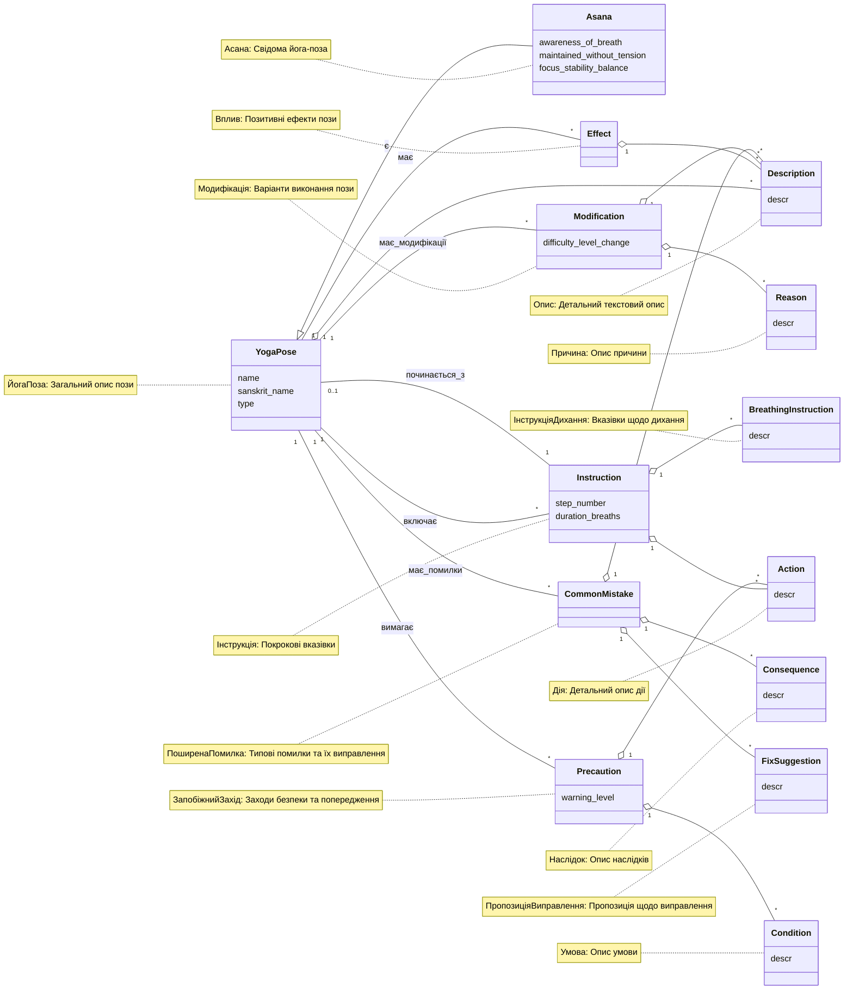

Gemini CLI

## Обґрунтування рішення на основі тексту йога-вправ

Представлена UML-діаграма концептуальних класів моделює предметну область йога-вправ на основі аналізу наданого тексту з `YogaDocs\YogaPoses.md`. Рішення базується на визначених сутностях, їх властивостях та зв'язках, з урахуванням усіх вимог завдання.

### Класи та їх атрибути:

1.  **YogaPose (ЙогаПоза):**
    *   **Обґрунтування:** Є головною концепцією, що об'єднує всі описи. Текст постійно посилається на різні "пози" (наприклад, "Поза собаки, яка дивиться вниз", "Поза гори").
    *   **Атрибути:**
        *   `name`: Назва пози (наприклад, "Поза собаки, яка дивиться вниз").
        *   `sanskrit_name`: Санскритська назва, якщо така є (наприклад, "Тадасана" для «Пози гори»).
        *   `type`: Тип пози (хоча явно не вказано як категорія, можна вивести з опису, наприклад, "стояча", "нахил вперед").

2.  **Asana (Асана):**
    *   **Обґрунтування:** Текст чітко розмежовує "позу" і "асану", зазначаючи: "кожна асана є позою; не кожна поза є асаною". Це вказує на відношення узагальнення, де `Asana` є спеціалізованим видом `YogaPose`.
    *   **Зв'язок:** `YogaPose <|-- Asana : є` відображає відношення "є видом" (спадкування).
    *   **Атрибути:** Ці атрибути виведені з визначення асани: "свідоме, стале положення тіла, яке: 1) виконується з усвідомленням дихання; 2) підтримується без напруги; 3) має на меті зосередження, стабільність і внутрішню рівновагу;".
        *   `awareness_of_breath` (усвідомлення_дихання)
        *   `maintained_without_tension` (без_напруги)
        *   `focus_stability_balance` (фокус_стабільність_баланс)

3.  **Effect (Вплив):**
    *   **Обґрунтування:** Кожна поза має розділ "Позитивні впливи", що описує її переваги. Оскільки впливів може бути кілька, це окремий клас.
    *   **Зв'язок:** `YogaPose "1" -- "*" Effect : має` відображає, що одна поза `YogaPose` може мати багато `Effect` (впливів).

4.  **Instruction (Інструкція):**
    *   **Обґрунтування:** Розділ "Покрокові інструкції" для кожної пози є послідовністю кроків. Кожен крок є окремою інструкцією.
    *   **Зв'язок:** `YogaPose "1" -- "*" Instruction : включає` відображає, що одна поза `YogaPose` включає багато `Instruction`.
    *   **Атрибути:**
        *   `step_number`: Номер кроку (наприклад, "1.", "2.").
        *   `duration_breaths`: Тривалість кроку в циклах дихання (наприклад, "Залишайтеся в позі на 10... циклів дихання").

5.  **Modification (Модифікація):**
    *   **Обґрунтування:** Розділ "Модифікації" для кожної пози описує, як її адаптувати. Одна поза може мати багато модифікацій.
    *   **Зв'язок:** `YogaPose "1" -- "*" Modification : має_модифікації` відображає, що одна поза `YogaPose` може мати багато `Modification`.
    *   **Атрибути:**
        *   `difficulty_level_change`: Зміна рівня складності (наприклад, "полегшення виконання", "ускладнити виконуючи із закритими очима").

6.  **CommonMistake (ПоширенаПомилка):**
    *   **Обґрунтування:** Розділ "Поширені помилки" ідентифікує типові помилки для кожної пози. Одна поза може мати багато поширених помилок.
    *   **Зв'язок:** `YogaPose "1" -- "*" CommonMistake : має_помилки` відображає, що одна поза `YogaPose` може мати багато `CommonMistake`.

7.  **Precaution (ЗапобіжнийЗахід):**
    *   **Обґрунтування:** Розділ "Безпека та запобіжні заходи" надає рекомендації та попередження. Одна поза може мати кілька запобіжних заходів.
    *   **Зв'язок:** `YogaPose "1" -- "*" Precaution : вимагає` відображає, що одна поза `YogaPose` вимагає дотримання багатьох `Precaution`.
    *   **Атрибути:**
        *   `warning_level`: Рівень попередження (наприклад, "не рекомендується", "слід уникати", "безпечна").

### Агреговані класи (для складних атрибутів):

Відповідно до правила 5, атрибути, що в майбутньому можуть мати складну структуру, були винесені в окремі класи з атрибутом `descr` та зв'язані агрегацією "one-to-many". Це дозволяє зберігати атомарність атрибутів у концептуальних класах, одночасно передбачаючи розширення деталізації цих описів.

*   **Description (Опис):**
    *   **Обґрунтування:** Загальні, детальні текстові описи зустрічаються в багатьох місцях (наприклад, "Загальний опис" пози, опис "Позитивних впливів", "Модифікацій", "Поширених помилок").
    *   **Зв'язки:** `YogaPose "1" o-- "*" Description`, `Effect "1" o-- "*" Description`, `Modification "1" o-- "*" Description`, `CommonMistake "1" o-- "*" Description`. Це означає, що, наприклад, `YogaPose` може мати багато `Description` (наприклад, різні довгі/короткі описи).
*   **Action (Дія):**
    *   **Обґрунтування:** Детальний опис конкретної дії (наприклад, "Встаньте", "Зігніть коліна" з "Покрокових інструкцій" або дії, які слід виконувати/уникати в "Запобіжних заходах").
    *   **Зв'язки:** `Instruction "1" o-- "*" Action`, `Precaution "1" o-- "*" Action`.
*   **Condition (Умова):**
    *   **Обґрунтування:** Описи умов, за яких слід застосовувати або уникати позу (наприклад, "якщо у вас травма зап’ястя" з "Безпеки та запобіжних заходів").
    *   **Зв'язок:** `Precaution "1" o-- "*" Condition`.
*   **Reason (Причина):**
    *   **Обґрунтування:** Пояснення причин для модифікацій (наприклад, "Якщо у вас недостатньо гнучкі м’язи задньої поверхні стегна" з "Модифікацій").
    *   **Зв'язок:** `Modification "1" o-- "*" Reason`.
*   **Consequence (Наслідок):**
    *   **Обґрунтування:** Описи наслідків поширених помилок (наприклад, "змінює траєкторію пози вперед" з "Поширених помилок").
    *   **Зв'язок:** `CommonMistake "1" o-- "*" Consequence`.
*   **FixSuggestion (ПропозиціяВиправлення):**
    *   **Обґрунтування:** Пропозиції щодо виправлення помилок (наприклад, "Підніміть куприк високо" з "Поширених помилок").
    *   **Зв'язок:** `CommonMistake "1" o-- "*" FixSuggestion`.
*   **BreathingInstruction (ІнструкціяДихання):**
    *   **Обґрунтування:** Специфічні вказівки щодо дихання (наприклад, "Вдихніть", "Видихніть" з "Покрокових інструкцій").
    *   **Зв'язок:** `Instruction "1" o-- "*" BreathingInstruction`.

### Іменовані асоціації:

*   **`Instruction "1" -- "0..1" YogaPose : починається_з`:**
    *   **Обґрунтування:** Цей зв'язок відображає ситуації, коли "Покрокові інструкції" явно вказують на початок з іншої пози (наприклад, "Почніть у «Позі гори»" для «Пози нахил вперед стоячи»). "0..1" кратність вказує на те, що не кожна інструкція обов'язково починається з іншої `YogaPose`. Назва "починається_з" є дієслівною та семантично відрізняється від прихованих назв агрегацій.

### Загальні зв'язки (асоціації):

Зв'язки типу `YogaPose "1" -- "*" ...` (наприклад, з `Effect`, `Instruction` тощо) вказують на те, що одна `YogaPose` може бути пов'язана з багатьма екземплярами цих класів, що відповідає структурі документа, де для кожної пози наведено кілька ефектів, інструкцій тощо.

Це рішення повністю відповідає всім наданим правилам та базується на детальному аналізі змісту документа `YogaDocs\YogaPoses.md`.
