# UML-діаграма концептуальних класів для йога-вправ

Створено за допомогою: Qwen CLI

```mermaid
classDiagram
    class YogaPose {
        <<abstract>>
        +String poseName
        +String sanskritName
        +String generalDescription
        +String positiveEffects
        +String stepByStepInstructions
        +String modifications
        +String commonMistakes
        +String safetyMeasures
    }

    class DownwardFacingDog {
        +String alternativeNames
    }

    class MountainPose {
        +String sanskritName: Tadasana
    }

    class RaisedHandsPose {
        
    }

    class StandingForwardBend {
        +String sanskritName: Uttanasana
    }

    class HalfForwardBend {
        +String sanskritName: Ardha Uttanasana
    }

    class WarriorIPose {
        +String sanskritName: Virabhadrasana I
    }

    class BodyPart {
        +String partName
        +String description
    }

    class MuscleGroup {
        +String groupName
        +String function
    }

    class Benefit {
        +String benefitType
        +String description
    }

    class Instruction {
        +int stepNumber
        +String description
    }

    class Modification {
        +String modificationType
        +String description
    }

    class SafetyMeasure {
        +String contraindication
        +String precaution
    }

    class CommonMistake {
        +String mistakeType
        +String correction
    }

    class PoseCategory {
        +String categoryName
        +String description
    }

    class DifficultyLevel {
        +String levelName
        +String description
    }

    %% Inheritance relationships
    YogaPose <|-- DownwardFacingDog
    YogaPose <|-- MountainPose
    YogaPose <|-- RaisedHandsPose
    YogaPose <|-- StandingForwardBend
    YogaPose <|-- HalfForwardBend
    YogaPose <|-- WarriorIPose

    %% Association relationships
    YogaPose "1" --> "*" BodyPart : affects
    YogaPose "1" --> "*" MuscleGroup : strengthens/extends
    YogaPose "1" --> "*" Benefit : provides
    YogaPose "1" --> "*" Instruction : has
    YogaPose "1" --> "*" Modification : has
    YogaPose "1" --> "*" SafetyMeasure : requires
    YogaPose "1" --> "*" CommonMistake : has
    YogaPose "1" --> "1" PoseCategory : belongs_to
    YogaPose "1" --> "1" DifficultyLevel : has

    %% Aggregation relationships
    MuscleGroup "1" o-- "*" BodyPart : includes
    Benefit "1" o-- "*" BodyPart : targets
```

## Коментарі до діаграми:

- **YogaPose** - абстрактний клас, що представляє загальну структуру будь-якої йога-пози
- **DownwardFacingDog**, **MountainPose**, **RaisedHandsPose**, **StandingForwardBend**, **HalfForwardBend**, **WarriorIPose** - конкретні реалізації йога-поз
- **BodyPart** - частини тіла, які задіяні в позі (наприклад, спини, ноги, руки)
- **MuscleGroup** - м'язові групи, які зміцнюються або розтягуються (наприклад, м'язи задньої поверхні стегна)
- **Benefit** - переваги від виконання пози (покращення постави, зміцнення м'язів)
- **Instruction** - покрокові інструкції для виконання пози
- **Modification** - модифікації пози для початківців або людей з обмеженнями
- **SafetyMeasure** - заходи безпеки та протипоказання
- **CommonMistake** - поширені помилки при виконанні
- **PoseCategory** - категорія пози (наприклад, нахили, згинання)
- **DifficultyLevel** - рівень складності (початківець, середній, просунутий)