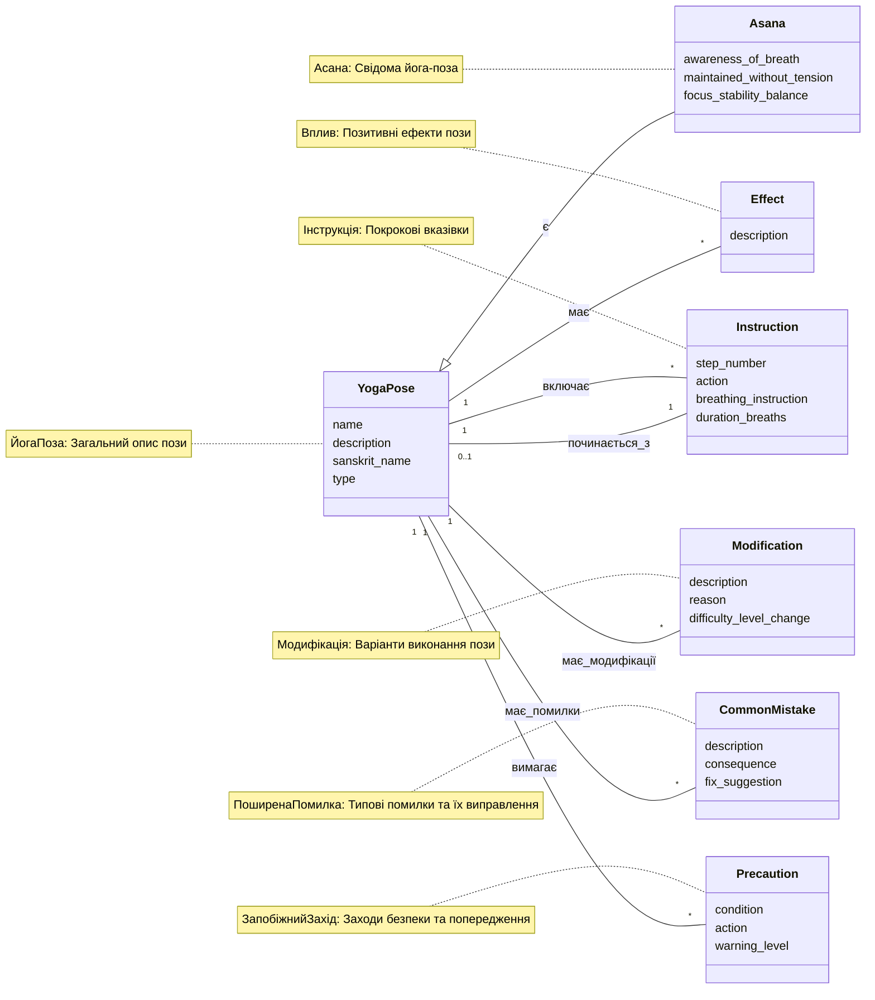

Gemini CLI

```mermaid
classDiagram
    direction LR
    class YogaPose {
        name
        description
        sanskrit_name
        type
    }
    note for YogaPose "ЙогаПоза: Загальний опис пози"

    class Asana {
        awareness_of_breath
        maintained_without_tension
        focus_stability_balance
    }
    note for Asana "Асана: Свідома йога-поза"

    class Effect {
        description
    }
    note for Effect "Вплив: Позитивні ефекти пози"

    class Instruction {
        step_number
        action
        breathing_instruction
        duration_breaths
    }
    note for Instruction "Інструкція: Покрокові вказівки"

    class Modification {
        description
        reason
        difficulty_level_change
    }
    note for Modification "Модифікація: Варіанти виконання пози"

    class CommonMistake {
        description
        consequence
        fix_suggestion
    }
    note for CommonMistake "ПоширенаПомилка: Типові помилки та їх виправлення"

    class Precaution {
        condition
        action
        warning_level
    }
    note for Precaution "ЗапобіжнийЗахід: Заходи безпеки та попередження"

    YogaPose <|-- Asana : є

    YogaPose "1" -- "*" Effect : має
    YogaPose "1" -- "*" Instruction : включає
    YogaPose "1" -- "*" Modification : має_модифікації
    YogaPose "1" -- "*" CommonMistake : має_помилки
    YogaPose "1" -- "*" Precaution : вимагає

    Instruction "1" -- "0..1" YogaPose : починається_з
```