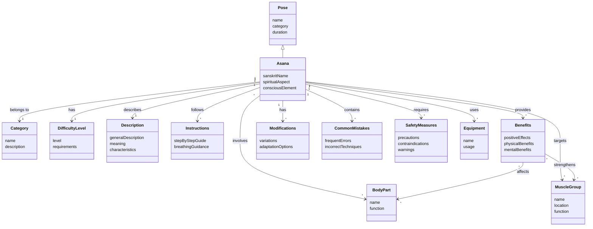

# UML Conceptual Class Diagram for Yoga Poses Application
Generated by Qwen CLI

## Обґрунтування рішень

Під час створення концептуальної UML-діаграми класів я враховував структуру та зміст документа з описом йога-вправ. Нижче наведено обґрунтування ключових рішень:

### 1. Ієрархія класів Pose та Asana
Важливо врахувати твердження з документа: "**кожна асана є позою; не кожна поза є асаною**". Це означає, що асана є спеціальним типом пози, яка має додаткові характеристики. Тому я створив ієрархію, де:
- **Pose** - загальний клас, що представляє будь-яке положення тіла
- **Asana** - спеціалізований підклас, що представляє свідоме, стале положення тіла, яке:
  1) виконується з усвідомленням дихання;
  2) підтримується без напруги;
  3) має на меті зосередження, стабільність і внутрішню рівновагу;
  4) має духовний аспект, який не є обов'язковим для простої пози.

### 2. Клас Description
Кожна асана має "Загальний опис", як зазначено в документі для кожної пози. Наприклад, для "Пози собаки, яка дивиться вниз": "Мабуть, найвідоміша поза фітнес-йоги «Поза собаки, яка дивиться вниз» – це зміцнення та розтягнення одночасно та в рівних частинах."

### 3. Клас Benefits
Документ містить розділ "Позитивні впливи" для кожної пози. Наприклад, для "Пози гори": "«Поза гори» – це вправа для всього тіла. Вона покращує поставу та усвідомлення тіла, зміцнює ноги та допомагає прийняти правильне положення тіла."

### 4. Клас Instructions
Кожна асана має "Покрокові інструкції", як зазначено в документі: "1. Встаньте, стопи паралельно, основи великих пальців ніг торкаються, а п'яти злегка розведені." Це формалізується в клас Instructions.

### 5. Клас Modifications
Документ містить розділ "Модифікації" для кожної пози. Наприклад: "Якщо у вас є проблеми з колінами, переконайтеся, що ви не фіксуєте коліна, а натомість тримайте їх злегка зігнутими."

### 6. Клас CommonMistakes
У документі є розділ "Поширені помилки", наприклад: "Не опускання п'ятки на килимок. Найбільш поширеною проблемою для початків у цій позі є те, що вони не опускають п'яти на килимок."

### 7. Клас SafetyMeasures
Кожна асана має розділ "Безпека та запобіжні заходи", наприклад: "Цю позу не рекомендується використовувати, якщо у вас травма зап'ястя, або якщо ви перебуваєте на останньому триместрі вагітності."

### 8. Класи BodyPart та MuscleGroup
Документ постійно згадує частини тіла та м'язи, які задіяні в асанах: "розтягує м'язи задньої поверхні стегна та гомілок, спини", "зміцнює м'язи рук та ніг", "вона розтягує задню частину вашого тіла, включаючи спину та плечі".

### 9. Клас Equipment
У документі згадуються допоміжні засоби: "ви можете покласти під голову блок для фітнес-йоги", "використовувати блок під руки або складений рушник під зап'ястя".

Зв'язки між класами визначені на основі семантики тексту. Наприклад, зв'язок "Asana 1 --> * Benefits" показує, що одна асана може мати багато переваг, а "Asana * --> * BodyPart" вказує, що асана може задіяти багато частин тіла, і одна частина тіла може бути задіяна в багатьох асанах.