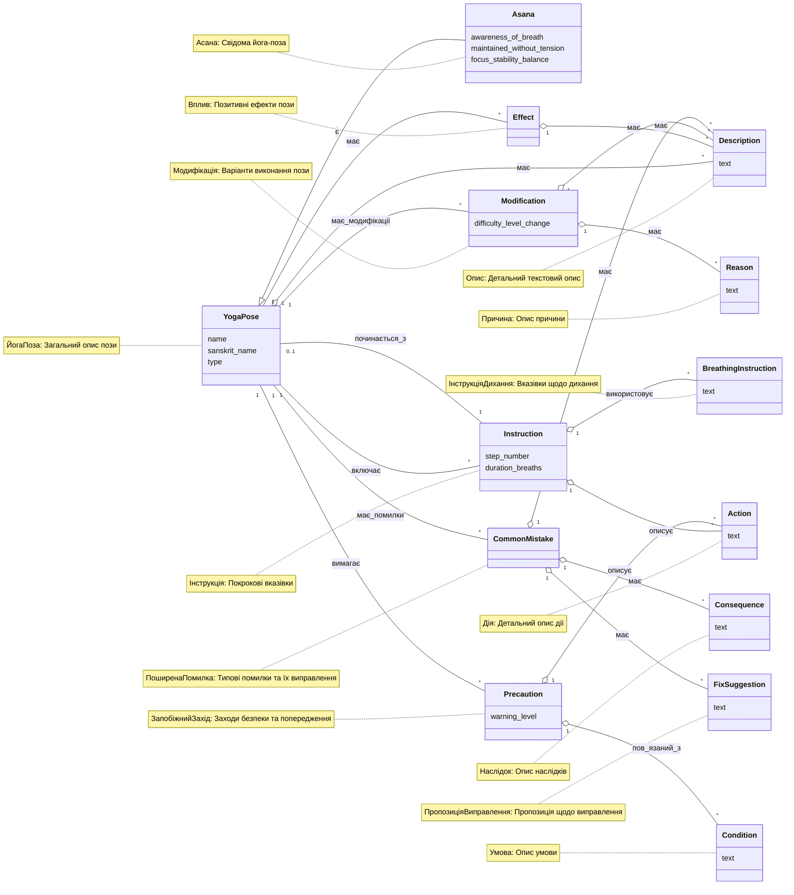

Gemini CLI

```mermaid
classDiagram
    direction LR
    class YogaPose {
        name
        sanskrit_name
        type
    }
    note for YogaPose "ЙогаПоза: Загальний опис пози"

    class Asana {
        awareness_of_breath
        maintained_without_tension
        focus_stability_balance
    }
    note for Asana "Асана: Свідома йога-поза"

    class Effect {
    }
    note for Effect "Вплив: Позитивні ефекти пози"

    class Instruction {
        step_number
        duration_breaths
    }
    note for Instruction "Інструкція: Покрокові вказівки"

    class Modification {
        difficulty_level_change
    }
    note for Modification "Модифікація: Варіанти виконання пози"

    class CommonMistake {
    }
    note for CommonMistake "ПоширенаПомилка: Типові помилки та їх виправлення"

    class Precaution {
        warning_level
    }
    note for Precaution "ЗапобіжнийЗахід: Заходи безпеки та попередження"

    class Description {
        text
    }
    note for Description "Опис: Детальний текстовий опис"

    class Action {
        text
    }
    note for Action "Дія: Детальний опис дії"

    class Condition {
        text
    }
    note for Condition "Умова: Опис умови"

    class Reason {
        text
    }
    note for Reason "Причина: Опис причини"

    class Consequence {
        text
    }
    note for Consequence "Наслідок: Опис наслідків"

    class FixSuggestion {
        text
    }
    note for FixSuggestion "ПропозиціяВиправлення: Пропозиція щодо виправлення"

    class BreathingInstruction {
        text
    }
    note for BreathingInstruction "ІнструкціяДихання: Вказівки щодо дихання"


    YogaPose <|-- Asana : є

    YogaPose "1" o-- "*" Description : має
    YogaPose "1" -- "*" Effect : має
    YogaPose "1" -- "*" Instruction : включає
    YogaPose "1" -- "*" Modification : має_модифікації
    YogaPose "1" -- "*" CommonMistake : має_помилки
    YogaPose "1" -- "*" Precaution : вимагає

    Effect "1" o-- "*" Description : має

    Instruction "1" o-- "*" Action : описує
    Instruction "1" o-- "*" BreathingInstruction : використовує
    Instruction "1" -- "0..1" YogaPose : починається_з

    Modification "1" o-- "*" Description : має
    Modification "1" o-- "*" Reason : має

    CommonMistake "1" o-- "*" Description : має
    CommonMistake "1" o-- "*" Consequence : має
    CommonMistake "1" o-- "*" FixSuggestion : має

    Precaution "1" o-- "*" Condition : пов_язаний_з
    Precaution "1" o-- "*" Action : описує
```