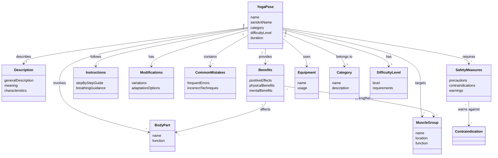

# UML Conceptual Class Diagram for Yoga Poses Application
Generated by Qwen CLI

## Обґрунтування рішень

Під час створення концептуальної UML-діаграми класів я враховував структуру та зміст документа з описом йога-вправ. Нижче наведено обґрунтування ключових рішень:

### 1. Основний клас YogaPose
Головною сутністю є "йога-поза" (yoga pose), як зазначено у вихідному документі: "**Йога-поза** (yoga pose) - це будь-яке положення тіла, яке використовується у практиці йоги". Клас містить атрибути, які характеризують кожну позу: назву, санскритську назву (наприклад, "тадасана" для "Пози гори"), категорію, рівень складності та тривалість.

### 2. Клас Description
Кожна асана має "Загальний опис", як зазначено в документі для кожної пози. Наприклад, для "Пози собаки, яка дивиться вниз": "Мабуть, найвідоміша поза фітнес-йоги «Поза собаки, яка дивиться вниз» – це зміцнення та розтягнення одночасно та в рівних частинах."

### 3. Клас Benefits
Документ містить розділ "Позитивні впливи" для кожної пози. Наприклад, для "Пози гори": "«Поза гори» – це вправа для всього тіла. Вона покращує поставу та усвідомлення тіла, зміцнює ноги та допомагає прийняти правильне положення тіла."

### 4. Клас Instructions
Кожна асана має "Покрокові інструкції", як зазначено в документі: "1. Встаньте, стопи паралельно, основи великих пальців ніг торкаються, а п'яти злегка розведені." Це формалізується в клас Instructions.

### 5. Клас Modifications
Документ містить розділ "Модифікації" для кожної пози. Наприклад: "Якщо у вас є проблеми з колінами, переконайтеся, що ви не фіксуєте коліна, а натомість тримайте їх злегка зігнутими."

### 6. Клас CommonMistakes
У документі є розділ "Поширені помилки", наприклад: "Не опускання п'ятки на килимок. Найбільш поширеною проблемою для початків у цій позі є те, що вони не опускають п'яти на килимок."

### 7. Клас SafetyMeasures
Кожна асана має розділ "Безпека та запобіжні заходи", наприклад: "Цю позу не рекомендується використовувати, якщо у вас травма зап'ястя, або якщо ви перебуваєте на останньому триместрі вагітності."

### 8. Класи BodyPart та MuscleGroup
Документ постійно згадує частини тіла та м'язи, які задіяні в асанах: "розтягує м'язи задньої поверхні стегна та гомілок, спини", "зміцнює м'язи рук та ніг", "вона розтягує задню частину вашого тіла, включаючи спину та плечі".

### 9. Клас Equipment
У документі згадуються допоміжні засоби: "ви можете покласти під голову блок для фітнес-йоги", "використовувати блок під руки або складений рушник під зап'ястя".

Зв'язки між класами визначені на основі семантики тексту. Наприклад, зв'язок "YogaPose 1 --> * Benefits" показує, що одна поза може мати багато переваг, а "YogaPose * --> * BodyPart" вказує, що поза може задіяти багато частин тіла, і одна частина тіла може бути задіяна в багатьох позах.