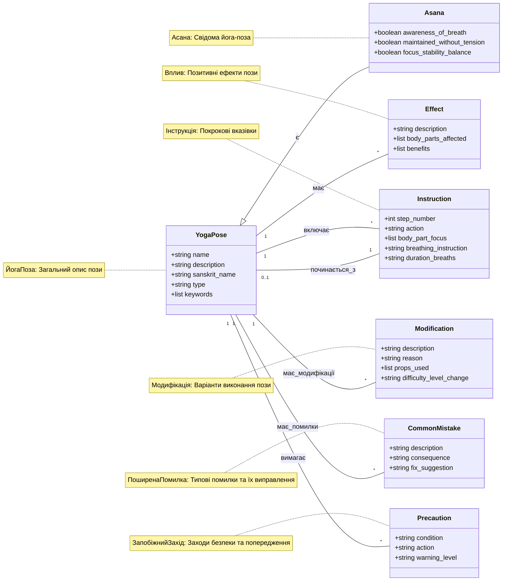

Gemini CLI

```mermaid
classDiagram
    direction LR
    class YogaPose {
        +string name
        +string description
        +string sanskrit_name
        +string type
        +list<string> keywords
    }
    note for YogaPose "ЙогаПоза: Загальний опис пози"

    class Asana {
        +boolean awareness_of_breath
        +boolean maintained_without_tension
        +boolean focus_stability_balance
    }
    note for Asana "Асана: Свідома йога-поза"

    class Effect {
        +string description
        +list<string> body_parts_affected
        +list<string> benefits
    }
    note for Effect "Вплив: Позитивні ефекти пози"

    class Instruction {
        +int step_number
        +string action
        +list<string> body_part_focus
        +string breathing_instruction
        +string duration_breaths
    }
    note for Instruction "Інструкція: Покрокові вказівки"

    class Modification {
        +string description
        +string reason
        +list<string> props_used
        +string difficulty_level_change
    }
    note for Modification "Модифікація: Варіанти виконання пози"

    class CommonMistake {
        +string description
        +string consequence
        +string fix_suggestion
    }
    note for CommonMistake "ПоширенаПомилка: Типові помилки та їх виправлення"

    class Precaution {
        +string condition
        +string action
        +string warning_level
    }
    note for Precaution "ЗапобіжнийЗахід: Заходи безпеки та попередження"

    YogaPose <|-- Asana : є

    YogaPose "1" -- "*" Effect : має
    YogaPose "1" -- "*" Instruction : включає
    YogaPose "1" -- "*" Modification : має_модифікації
    YogaPose "1" -- "*" CommonMistake : має_помилки
    YogaPose "1" -- "*" Precaution : вимагає

    Instruction "1" -- "0..1" YogaPose : починається_з
```